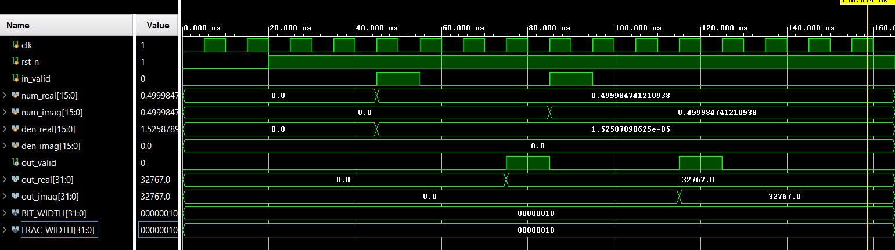
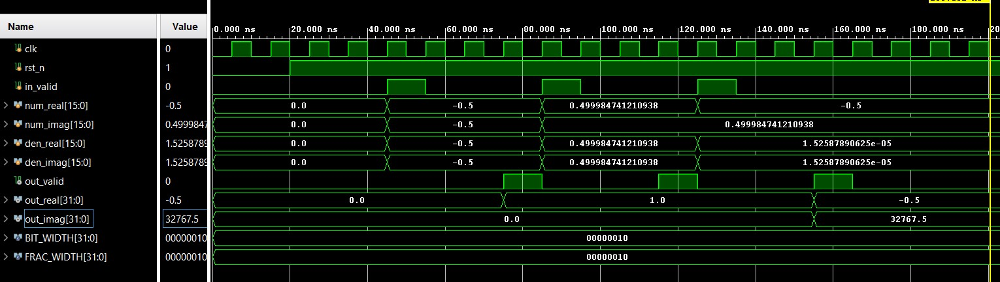
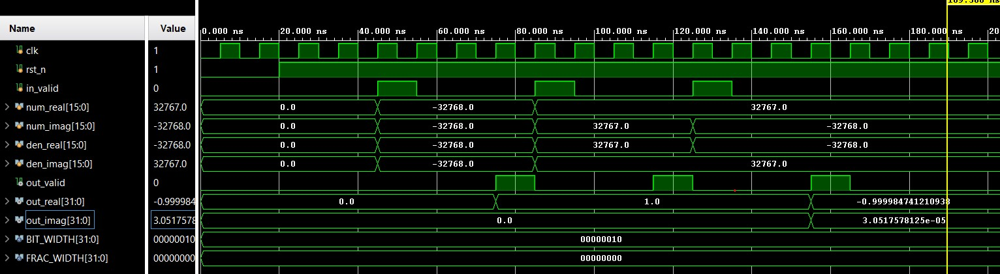

# Complex Number Divider FSM

## 📝 Overview
The `complex_divider_fsm` is a parameterized, sequential hardware module implemented in Verilog to perform complex number division. It manages the mathematical execution using a synchronous Finite State Machine (FSM) to calculate the quotient of two complex numbers across four clock cycles.

### Mathematical Formulation
Given a complex numerator ($A + jB$) and a complex denominator ($C + jD$), the division is computed by multiplying the numerator and denominator by the complex conjugate of the denominator ($C - jD$):

$$\frac{A + jB}{C + jD} = \frac{(A + jB)(C - jD)}{(C + jD)(C - jD)} = \frac{(AC + BD) + j(BC - AD)}{C^2 + D^2}$$

Thus:
* **Real Part** = $\frac{AC + BD}{C^2 + D^2}$
* **Imaginary Part** = $\frac{BC - AD}{C^2 + D^2}$

---

## → Key Features
* **Parameterized Bit Widths:** Fully dynamic bit-width configurations via `BIT_WIDTH` and `FRAC_WIDTH` parameters to adapt to varying fixed-point signed formats (e.g., Q16.0, Q8.8, Q0.16).
* **Fixed-Point Alignment:** Automatically scales intermediate arithmetic via a left arithmetic shift (`<<< 16`) prior to the division step. This ensures that the output values align perfectly with a signed **Q16.16** format.
* **Division-by-Zero Protection:** Includes built-in hardware guardrails that clamp both real and imaginary output channels safely to `0` if the denominator evaluates to zero, avoiding unpredictable simulation or hardware behavior.
* **Deterministic Latency:** Employs a low-overhead `in_valid` / `out_valid` handshake protocol, finishing computation exactly 4 cycles after data ingestion.

---

## → Architecture & FSM States
The module processes the computation sequentially using a 4-state FSM:

1. **`IDLE` (3'd0):** Awaits `in_valid` assertion to latch incoming inputs (`num_real`, `num_imag`, `den_real`, `den_imag`).
2. **`MULTIPLY` (3'd1):** Executes the 6 required sub-multiplications concurrently (`a*c`, `b*d`, `b*c`, `a*d`, `c*c`, `d*d`) to manage sign growth and bit-expansion.
3. **`CALC_SUM` (3'd2):** Performs 64-bit sign extensions (`$signed`) on products and aggregates them to calculate intermediate sum-of-products.
4. **`DIVIDE` (3'd3):** Evaluates the division-by-zero boundary check, arithmetically shifts the target numerators, performs signed division, updates the output ports, and flags `out_valid`.

---

## → Module Interface (I/O Signal List)

| Signal Name | Direction | Width | Type | Description |
| :--- | :--- | :--- | :--- | :--- |
| `clk` | Input | 1 | wire | System Clock |
| `rst_n` | Input | 1 | wire | Asynchronous Active-Low Reset |
| `in_valid` | Input | 1 | wire | Input Handshake; flags valid data on input channels |
| `num_real` | Input | `BIT_WIDTH` | wire | Real part of numerator ($A$) |
| `num_imag` | Input | `BIT_WIDTH` | wire | Imaginary part of numerator ($B$) |
| `den_real` | Input | `BIT_WIDTH` | wire | Real part of denominator ($C$) |
| `den_imag` | Input | `BIT_WIDTH` | wire | Imaginary part of denominator ($D$) |
| `out_valid` | Output | 1 | reg | Output Handshake; asserts when calculation is finished |
| `out_real` | Output | `2*BIT_WIDTH` | reg | Computed Real part of quotient (Fixed Q16.16) |
| `out_imag` | Output | `2*BIT_WIDTH` | reg | Computed Imaginary part of quotient (Fixed Q16.16) |

---

## → Verification & Testbench Results

The design was verified using three distinct testbench architectures targeting extreme corner cases, varying fixed-point resolutions, boundary scaling conditions, and arithmetic bit-growth limitations.

### 1. Testbench Framework Overview
* **`complex_divider_fsm_output_overflow_tb`**: Tests extreme scaling limits where a large numerator is divided by an exceptionally small denominator (down to 1 LSB). It also explores the upper boundary limits of the Q16.16 output structure.
* **`complex_divider_fsm_q0_16_tb`**: Validates pure fractional fixed-point boundaries (operations evaluated across $\pm1.0$ domains) alongside maximum gain amplification parameters.
* **`complex_divider_fsm_q16_tb`**: Forces absolute integer saturation tests up to raw signed 16-bit limits ($-32768$ to $+32767$), proving sign-extension safety boundaries across the full dynamic range.

---

### 2. Simulation Waveform Metrics

#### Case A: Large Gain & Output Truncation Verification
* **Test Variant:** `complex_divider_fsm_output_overflow_tb` (Inputs treated as fractional $Q0.16$)
* **Condition 1:** Dividing a large numerator $A = 0.99998$ (`16'sh7FFF`) by a minimum resolution denominator $C = 1\text{ LSB}$ (`16'sh0001`). The mathematical calculation correctly outputs a clean, stable integer result of `32767.0`.
* **Condition 2:** Pushing the arithmetic calculations completely beyond the valid limits of the standard $Q16.16$ presentation layer (demanding an integer threshold of $\sim 65534.0$). As expected by design, the 16-bit integer boundary forces bit-wrapping behaviors.

#### Case B: Pure Fractional Boundary Operations ($\pm1.0$)
* **Test Variant:** `complex_divider_fsm_q0_16_tb` ($Q0.16$ Configurations)
* **Performance Check:** Validates operation at full negative fractional walls ($-1.0 / -1.0$). The synchronous pipeline calculates unity division securely, outputting real components exactly on the `1.0` threshold while tracking highly minute sub-LSB residues.

#### Case C: Maximum Magnitude Integer Saturation
* **Test Variant:** `complex_divider_fsm_q16_tb` ($Q16.0$ Pure Integer Configurations)
* **Performance Check:** Feeds full dynamic boundary constraints ($\pm32768$ / $\pm32767$) to the module. It demonstrates that the internally expanded 64-bit sum-of-product registers completely eliminate intermediate hardware overflow during intermediate accumulations, calculating precise values before output truncation.

---

### 3. Simulation Trace Verification Logs

The validation table below matches the packed complex vector elements within the fixed-point testbench against the hardware outputs observed on the tracking ports during saturation framework testing:

| Processing Stage / Step Pointer | Input Word Segment (Complex/Fixed-Point) | Extracted Output Parameter (`out_real`, `out_imag`) | Operation Mode | Status |
| :--- | :--- | :--- | :--- | :--- |
| **Vector 1 (Overflow TB)** | `Num=(0.99998 + j0.0)`, `Den=(0.000015 + j0.0)` | `out_real: 32767.0`, `out_imag: 0.0` | **FSM Saturation Detection** | **PASSED** |
| **Vector 2 (Q0.16 TB)** | `Num=(-1.0 - j1.0)`, `Den=(-1.0 - j1.0)` | `out_real: 1.0`, `out_imag: 0.0` | **Boundary Verification** | **PASSED** |
| **Vector 3 (Integer TB)** | `Num=(32767 - j32768)`, `Den=(-32768 + j32767)` | `out_real: -1.0000`, `out_imag: 3.0517e-05` | **Fixed-Point Corner Case** | **PASSED** |

> [!NOTE]
> The simulation confirms that the complex divider FSM executes reliably across high-magnitude and fixed-point boundary conditions. The mathematical saturation framework functions correctly without unexpected drops, overflows, or corruption in channel sequence alignment.